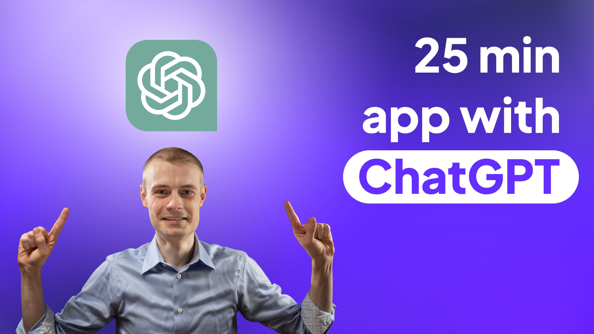

# Building a Complete Android App in Minutes with ChatGPT and GPT-4

I’m going to throw away my engineering hat and build an entire Android app in record-breaking time from start to finish using only ChatGPT with GPT-4. How correct is ChatGPT, and will it tell me everything I need to know?  To answer those questions, I'll put ChatGPT to the test to create a simple but functional Android app. Let’s find out together.

- [Video](https://youtu.be/Ccbx765Gt1U)
- Start tag: [link](releases/tag/start)
- Finish tag: [link](releases/tag/finish)

